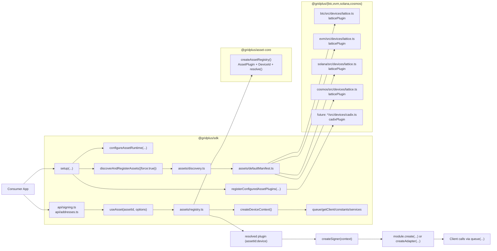
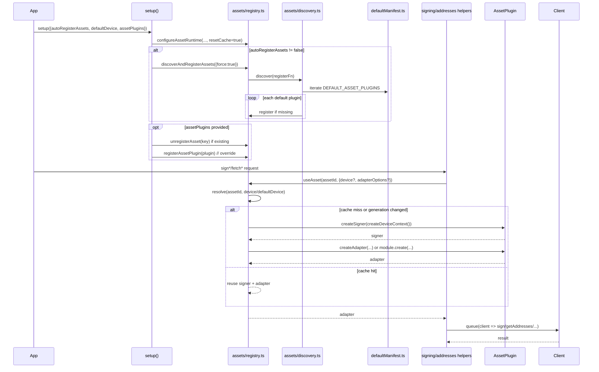
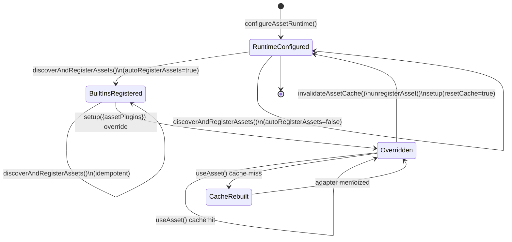

# Asset Registry Architecture (SDK + Asset Packages)

## 1) Component View

## 2) Runtime Flow (Setup + Use)

## 3) Registry + Cache Lifecycle

## 4) Behavior Matrix

| Scenario | Behavior |
| :-- | :-- |
| `autoRegisterAssets: true` | Built-in manifest plugins are registered during `setup()`. |
| `autoRegisterAssets: false` | Built-ins are skipped; only explicit plugins exist. |
| Custom `assetPlugins` collides with built-in key | Existing key is unregistered, then custom plugin is registered (override). |
| Duplicate keys inside `assetPlugins` input | `setup()` throws. |
| Discovery registration failure for one default plugin | Warning logged; discovery continues with remaining plugins. |
| `useAsset` unresolved asset/device | Throws with available device list for that asset (if any). |

## 5) Source Map

- `packages/sdk/src/api/setup.ts`
- `packages/sdk/src/api/signing.ts`
- `packages/sdk/src/api/addresses.ts`
- `packages/sdk/src/assets/registry.ts`
- `packages/sdk/src/assets/discovery.ts`
- `packages/sdk/src/assets/defaultManifest.ts`
- `packages/sdk/src/assets/context.ts`
- `packages/assets/asset-core/src/index.ts`
- `packages/assets/btc/src/devices/lattice.ts`
- `packages/assets/evm/src/devices/lattice.ts`
- `packages/assets/solana/src/devices/lattice.ts`
- `packages/assets/cosmos/src/devices/lattice.ts`
