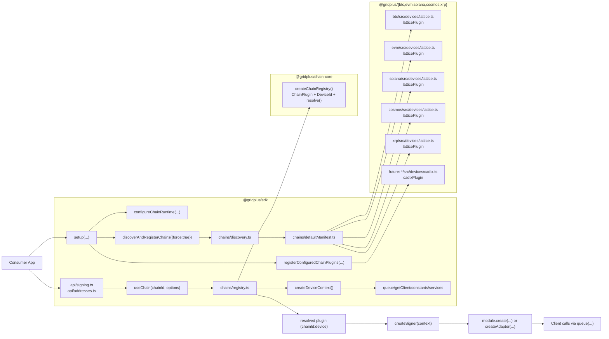
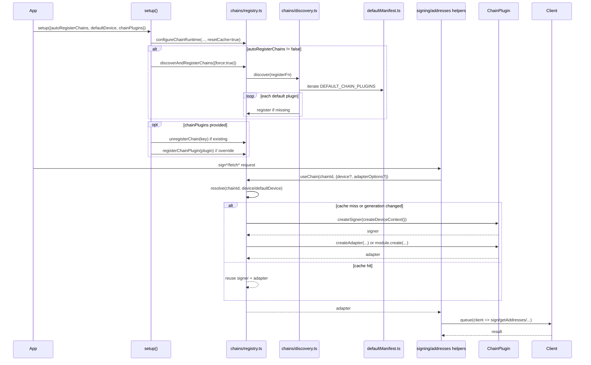
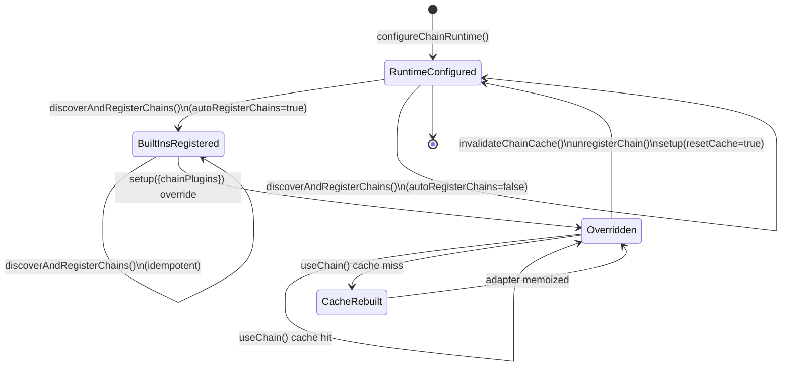

# Chain Registry Architecture (SDK + Chain Packages)

## 1) Component View

## 2) Runtime Flow (Setup + Use)

## 3) Registry + Cache Lifecycle

## 4) Behavior Matrix

| Scenario | Behavior |
| :-- | :-- |
| `autoRegisterChains: true` | Built-in manifest plugins are registered during `setup()`. |
| `autoRegisterChains: false` | Built-ins are skipped; only explicit plugins exist. |
| Custom `chainPlugins` collides with built-in key | Existing key is unregistered, then custom plugin is registered (override). |
| Duplicate keys inside `chainPlugins` input | `setup()` throws. |
| Discovery registration failure for one default plugin | Warning logged; discovery continues with remaining plugins. |
| `useChain` unresolved chain/device | Throws with available device list for that chain (if any). |

## 5) Source Map

- `packages/sdk/src/api/setup.ts`
- `packages/sdk/src/api/signing.ts`
- `packages/sdk/src/api/addresses.ts`
- `packages/sdk/src/chains/registry.ts`
- `packages/sdk/src/chains/discovery.ts`
- `packages/sdk/src/chains/defaultManifest.ts`
- `packages/sdk/src/chains/context.ts`
- `packages/chains/chain-core/src/index.ts`
- `packages/chains/btc/src/devices/lattice.ts`
- `packages/chains/evm/src/devices/lattice.ts`
- `packages/chains/solana/src/devices/lattice.ts`
- `packages/chains/cosmos/src/devices/lattice.ts`
- `packages/chains/xrp/src/devices/lattice.ts`
